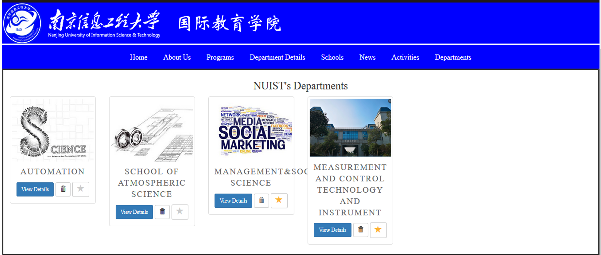

# What is NUISTISD?

NUISTISD is a website for a university that provides information about schools, departments, programs, News, Notes, activities, etc., as shown in the screenshot.
NUISTISD has two sides: the admin and the ordinary user. Everything on our website is dynamic, even the logos. We tried to use new website creation techniques, such as navigating, sliding, etc. We used the groups and users to manage the privileges for users.
NUISTISD is a single-page website.
We use a database. The current version is SQLite, but we can move to any other DBMS system because Django creates the model first. 


```
** We used Django 2.2.3, which is a high-level Python Web framework.**
**CSS**
**Java Script**
**JQuery**
**Bootstrap**
```
# programs page

<br>
<div align=left>  </div>

# How does it work?

Please read the NUISTISD Instructions file <div align=left> <a href="NUISTISD Instructions.pdf">here</a>  </div> . 
